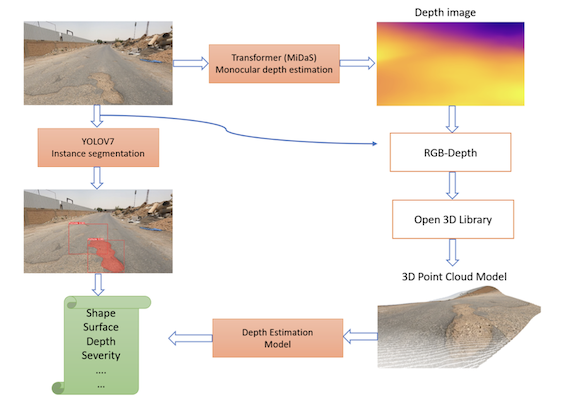

# Pothole Severity Estimation

## Overview
This project proposes an intelligent system that detects potholes, quantifying and delineate their shape in the 2D space; and estimate the depth information in the 3D space.

## Dataset
For generating the training bounding boxes and segmentation masks, we annotate some of the  given images using Roboflow: https://roboflow.com/.

## To run

1. Clone the  model.
<code>https://github.com/LailaMB/Pothole_Severity_Estimation.git</code>

2. Run the <code> python segment/predict.py --weights yolov7/seg/Pothole_model.pt --source Theme2_seg_data/input.mp3 --name coco</code> to get the segmentation results.
3. Run <code> Depthmap3DCloud/Depth_map_generation.py </code> to generate the depth map and the 3d point cloud.
